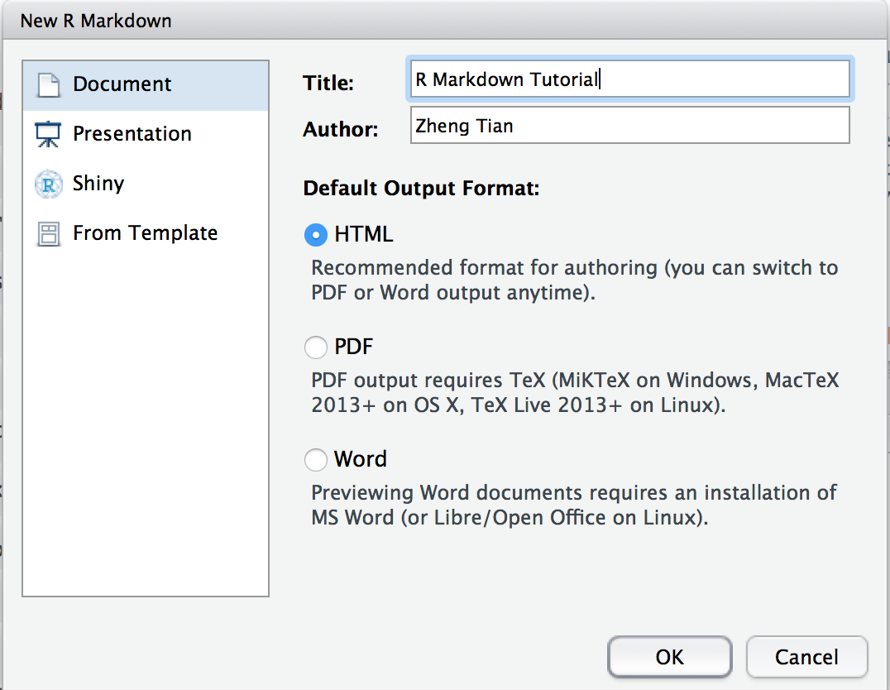

```{r setup, include=FALSE}
knitr::opts_chunk$set(echo = TRUE)
```

# R Markdown

R Markdown provides an authoring framework for data science. You can use a single R Markdown file to both

* save and execute code
* generate high quality reports that can be shared with an audience

This document gives you a very brief tutorial for R Markdown. You can also read tutorial documents in the this link, <http://rmarkdown.rstudio.com/lesson-1.html>. 

## Create a R Markdown file

An R Markdown file is a plain text file that has the extension `.Rmd`. In RStudio, you can easily create a new R Markdown file through the following steps:

1. Click `File -> New File -> R Markdown`. 
2. At the left panel in the window jumping up, choose `Document`, and at the    right panel, enter the title and author name of the document. Then, choose    `HTML` as the default output format and click `OK`. 
   {width=75%}
3. A short R Markdown document is generated with some elements in it as a       template. 

## How R Markdown works

The underlying mechanism of R Markdown is shown as follows

  {width=90%}

- To generate an `HTML` document from a R Markdown file, click `Knit` button   in RStudio. 
- A built-in HTML browser will be invoked to have a preview of the document.
- You can also create a PDF file by click the little arrow beside `Knit`       button, and choose `Knit to PDF`. 


# The Elements in a R Markdown File

## The Paragraph

A new paragraph is created by following one or more blank lines. 

## Headers and sections

The `#` sign defines a top-level header and a section, `##` defines a level-two header and a subsection. 
```
# Section
## A subsection
### A subsubsection
```

## Emphasis

Markdown uses `**bold**` to use the **bold** font and `*italic*` to use the *italic* font. 

## List

We can create a list as follows,
```
* Item 1
* Item 2
    + Item 2a
    + Item 2bn
```
* Item 1
* Item 2
    + Item 2a
    + Item 2b

The list can also be numbered as follows,
```
1. Item 1
2. Item 2
3. Item 3
    + Item 3a
    + Item 3b
```

## Equations

R Markdown uses the LaTeX command to create mathematical expressions. 

For example, the linear regression equation in display mode is
```
  \[Y_i = \beta_0 + \beta_1 X_i + u_i, \text{ for } i = 1, \ldots, n\]
```
which generates
$$Y_i = \beta_0 + \beta_1 X_i + u_i, \text{ for } i = 1, \ldots, n$$  

And the in-line mathematical expression is `$\beta_1 = \frac{\Delta Y}{\Delta X}$`, generating $\beta_1 = \frac{\Delta Y}{\Delta X}$.


# R Code Chunk

Most importantly, we can include R code along with the output in a R Markdown file. You can quickly insert chunks like these into your file with

- the keyboard shortcut `Ctrl + Alt + I` (OS X: `Cmd + Option + I`)
- the `Insert` button in the editor toolbar
- or by typing the chunk delimiters \`\`\`{r}  and  \`\`\`.

The behaviors of the R code chunk can be controlled by adding options.

```{r, echo=TRUE, results='markup'}
summary(mtcars[, 1:3])
```

The options that are often used include `echo`, `results`, `include`, and `eval`, etc. 

```{r, echo=TRUE, results='asis'}
library(knitr)
kable(mtcars[1:5, 1:3])
```

We can also embed plots, for example:

```{r, echo=TRUE, fig.cap="A Scatterplot", fig.align='center', fig.pos="!h"}
  plot(mtcars$disp, mtcars$mpg, 
       xlab = "displacement", ylab = "MPG")
```

Finally, we use the following reference card to quickly find the relevant command in R Markdown, [rmarkdown_cheatsheet.pdf](./rmarkdown_cheatsheet.pdf). 


